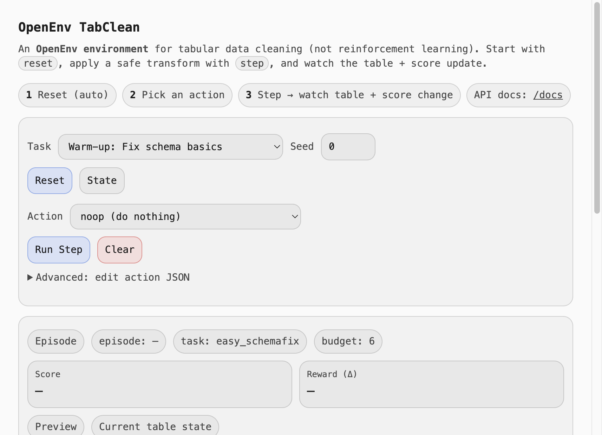
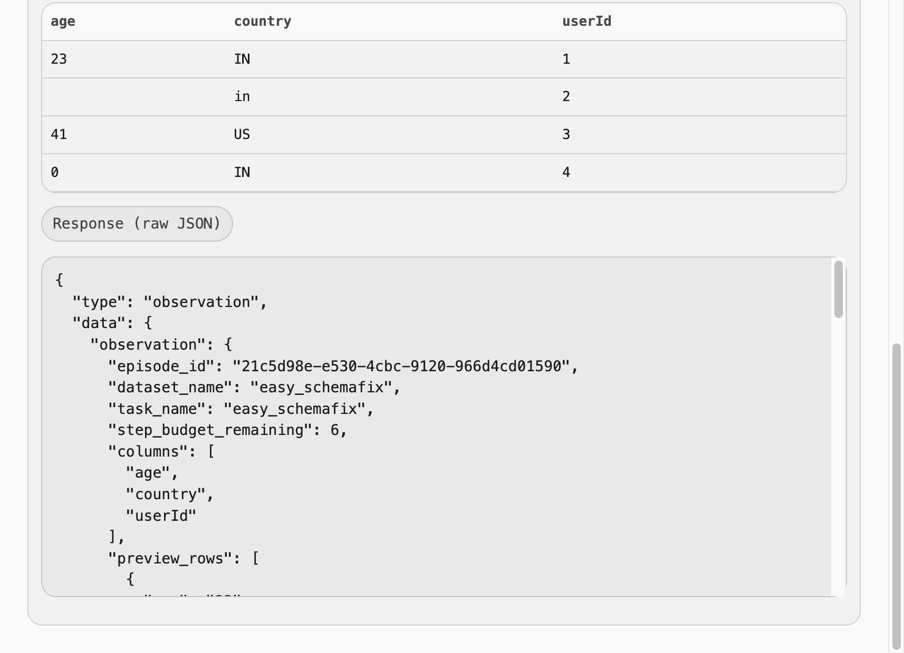
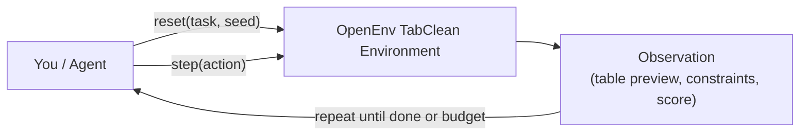

# OpenEnv-TabClean: Tabular data cleaning and schema repair

TabClean is an OpenEnv environment for evaluating an agent’s ability to **clean messy tabular data into a target schema** using a safe transformation DSL and deterministic scoring.

## Live demo (Hugging Face Space)

- UI: [sapana1234-openenv-tabclean.hf.space](https://sapana1234-openenv-tabclean.hf.space/)
- API docs: [sapana1234-openenv-tabclean.hf.space/docs](https://sapana1234-openenv-tabclean.hf.space/docs)

## Application preview





## How it works (visual)



## Why this is useful

Data cleaning and schema repair is a common real-world bottleneck in analytics/ETL. TabClean provides deterministic tasks + graders for agent evaluation.

## API

This environment implements the standard OpenEnv interface:

- `reset(seed=..., task=...)`
- `step(action)`
- `state()`

Typed models:

- `TabCleanAction` in `models.py`
- `TabCleanObservation` in `models.py`
- `TabCleanState` in `models.py`

## Tasks

Three tasks are included (easy → medium → hard):

- `easy_schemafix`
- `medium_dedupe_normalize`
- `hard_parse_normalize_filter`

## Run locally (environment server)

Start server:

```bash
uvicorn server.app:app --host 0.0.0.0 --port 8000 --reload
```

Or (OpenEnv/uv workflow):

```bash
uv run server
```

## Demo script

Run the required demo script:

```bash
python3 demo.py
```

## Baseline agent (`inference.py`) + required env vars

`inference.py` uses the OpenAI client and reads configuration from environment variables:

- `API_BASE_URL` (default set in code)
- `MODEL_NAME` (default set in code)
- `HF_TOKEN` (no default; required to use the Hugging Face router)
- `LOCAL_IMAGE_NAME` (optional)

If `HF_TOKEN` is not set, `inference.py` falls back to a deterministic heuristic policy (still prints the required `[START]`, `[STEP]`, `[END]` logs).

Run:

```bash
python3 inference.py
```

## OpenEnv validation

```bash
openenv validate
```

