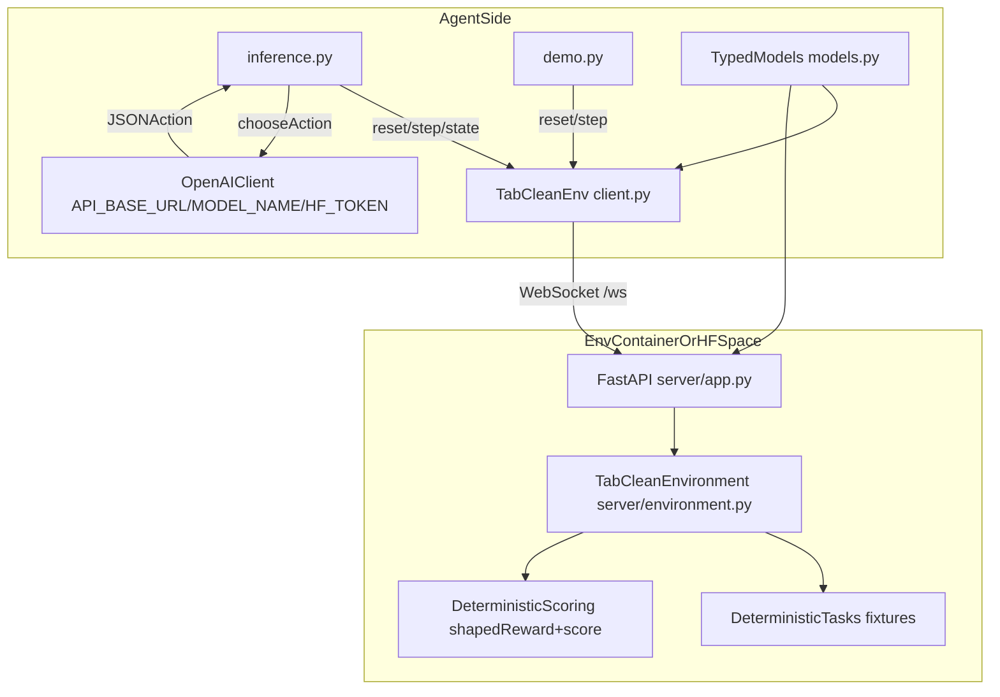

# OpenEnv-TabClean — Tabular data cleaning & schema repair

TabClean is a **real-world** OpenEnv environment that evaluates an agent’s ability to **clean messy tabular data into a target schema** using a safe, auditable transformation DSL.

## Quickstart (local)

```bash
git clone https://github.com/JharwalSapna/OpenEnv-TabClean.git
cd OpenEnv-TabClean

python3 -m venv .venv
. .venv/bin/activate
python -m pip install -r requirements.txt

uvicorn server.app:app --host 0.0.0.0 --port 8000 --reload
```

In another terminal:

```bash
. .venv/bin/activate
python3 demo.py
```

## Why this is useful

Data cleaning and schema repair is a common real-world bottleneck in analytics/ETL. TabClean provides deterministic tasks + graders for agent evaluation.

## API

This environment implements the standard OpenEnv interface:

- `reset(seed=..., task=...)`
- `step(action)`
- `state()`

Typed models:

- `TabCleanAction` in `models.py`
- `TabCleanObservation` in `models.py`
- `TabCleanState` in `models.py`

## Architecture



## Tasks

Three tasks are included (easy → medium → hard):

- `easy_schemafix`
- `medium_dedupe_normalize`
- `hard_parse_normalize_filter`

## Run locally

Install deps (recommended: virtual env):

```bash
python3 -m venv .venv
. .venv/bin/activate
python -m pip install -r requirements.txt
```

Start server:

```bash
uvicorn server.app:app --host 0.0.0.0 --port 8000 --reload
```

Or (OpenEnv/uv workflow):

```bash
uv run server
```

## Demo script (submission requirement)

The submission FAQ requires a demo script. Run:

```bash
python3 demo.py
```

### Local `.env` (recommended)

Create a local `.env` file so you don’t have to export variables each time:

```bash
cp .env.example .env
```

Then edit `.env` and set `HF_TOKEN`, etc. (`.env` is gitignored).

You can customize:

- `TAB_CLEAN_BASE_URL` (default `http://localhost:8000`)
- `TAB_CLEAN_TASK` (default `easy_schemafix`)
- `TAB_CLEAN_SEED` (default `0`)

Smoke test (sync client):

```python
from client import TabCleanEnv
from models import TabCleanAction

with TabCleanEnv(base_url="http://localhost:8000").sync() as env:
    r = env.reset(task="easy_schemafix", seed=0)
    r = env.step(TabCleanAction(op="noop", args={}))
    print(r.observation.message)
```

## Baseline inference

The required baseline script is `inference.py` at repo root.

It uses the OpenAI client with the required env vars:

- `API_BASE_URL`
- `MODEL_NAME`
- `HF_TOKEN`
- `LOCAL_IMAGE_NAME` (optional)

And prints strict `[START]`, `[STEP]`, `[END]` logs.

Run it locally:

```bash
python3 inference.py
```

## Local score sanity check

`grade.py` is a simple helper that runs through the task list and prints deterministic scores in `[0, 1]` against a running server:

```bash
python3 grade.py
```

## Docker

The validator may check for `Dockerfile` in repo root or `server/Dockerfile`. This repo includes **both**.

Build and run:

```bash
docker build -t tabclean-env:local .
docker run --rm -p 8001:8000 tabclean-env:local
```

Then point the client at `TAB_CLEAN_BASE_URL=http://localhost:8001`.

## OpenEnv validation

```bash
openenv validate
```

## Troubleshooting

### `ModuleNotFoundError: No module named 'openenv'`

This means you're running `python3 demo.py` with a Python interpreter that **doesn't have dependencies installed**.

Fix:

```bash
. .venv/bin/activate
python -m pip install -r requirements.txt
python3 demo.py
```

## What you need to submit (per FAQ)

- A **public GitHub repo** with:
  - environment code
  - `requirements.txt`
  - a demo script (this repo: `demo.py`)
  - `README.md`
- A deployed **Hugging Face Space URL** showcasing the working demo

